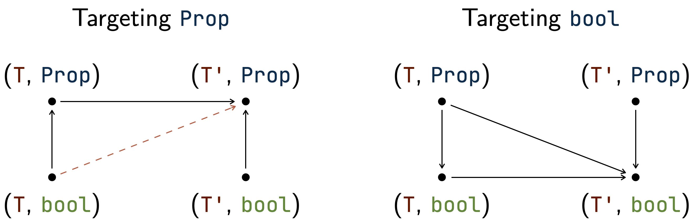

# Tutorial

Trakt exposes the `trakt` tactic to preprocess goals, but this tactic cannot operate alone.
Indeed, the tactic being general, it needs to be informed about what to translate.
Before running `trakt` on Coq goals, the user must fill a database with terms to translate, along with their translation and proofs to certify these atomic transformations.

!> Do not forget to import Trakt at the beginning of your Coq file.

```coq
From Trakt Require Import Trakt.
```

### Filling the database

Four commands are available, each one for a distinct class of information:
- **embedding**: a pair of types `T` and `T'` indicating that the user would like values in `T` to be explicitly cast into `T'` during the translation;
- **relation**: two n-ary predicates `R` and `R'` indicating that the user would like all occurrences of `R` in the goal to be replaced with `R'`;
- **symbol**: two non logical values `s` and `s'` indicating that the user would like all occurrences of `s` in the goal to be replaced with `s'`;
- **term triggering conversion**: a term whose occurrences in the goal can be reduced to one of the above declarations, thus requiring the use of Coq conversion.

More information about these declarations can be found below.

#### Embeddings

An **embedding** from type `T` to type `T'` is a pair of functions `f : T -> T'` and `g : T' -> T` such that their compositions are identities.
One declares an embedding so that the tactic is able to replace all values in `T` with values in `T'` in the goal.
Here is the syntax for the command adding an embedding to the database:

```coq
Trakt Add Embedding (T) (T') (f) (g) (gof_id) (fog_id).
```

In this command, the expected type of `gof_id` is the following:

```coq
forall (t : T), t = g (f t)
```

##### Partial embeddings

In some cases, the embedding is not surjective, *i.e.* the composition `fun (t' : T') => f (g t')` is not an identity (`fog_id` cannot be proven).
For example, in the case of an embedding from `nat` to `Z`, the explicit cast `Z.to_nat` maps all negative numbers to 0.
To cover this situation and still allow users to process `nat` values into `Z`, another version of the command is available:

```coq
Trakt Add Embedding (T) (T') (f) (g) (gof_id) (fog_cond_id) (cond_f_always_true).
```

With this version, the second composition must be an identity **under a condition** given by the user (*e.g.* positivity), and this condition must be proven true for any embedded value (*e.g.* all `Z` values coming from `nat` are positive).

#### Relations

**Relations** are n-ary predicates in `bool` or `Prop`, describing properties, orders, equality, etc.

```
Trakt Add Relation N [ (target) ] (R) (R') (equiv).
```

In this command, `target` is the target embedding type (*e.g.* when changing `Nat.eqb` into `Z.eqb`, the target is `Z`).
If it is not provided, a basic inference mode guesses it.
The `equiv` parameter is a logical link between both relations.
Its expected type **varies** according to the logical type in which `R` and `R'` live, as well as previous declarations on the types of the arguments.
For a binary relation in `Prop` on types `T` and `U` with no embeddings declared on `T` and `U`, the `N` parameter will be `2` and the expected type of `equiv` is the following:

```coq
forall (t : T) (u : U), R t u <-> R' t u
```

For a ternary relation in `bool` on type `A` with an embedding from `A` to `B` through a function `A2B`, `N` equals `3` and the expected type is the following:

```coq
forall (a1 a2 a3 : A), R a1 a2 a3 = R' (A2B a1) (A2B a2) (A2B a3)
```

!> The variability on the expected types of the proofs makes Trakt easier to use, as it allows declaring everything that falls into the concept of relation with a single command, but the user has to mind the order of declarations. For the tool to work correctly, type embeddings must be declared **before** relations and symbols.

An example of use of relations is switching between propositional and boolean ways of expressing a decidable equality.
For example, in a goal with values in a type `E` equipped with a decidable equality test `eqb`, Trakt can express equalities in this goal with either `=` (*i.e.* `@eq E`) or `eqb`, according to the target logical type.

Note that the command also works for more complex relations, such as relation families.
Please head to the [GitHub repository](https://github.com/ecranceMERCE/trakt/blob/67387d3f2709001bc88f5625330381da8b4790c7/example/Example.v#L293) to see an example.

#### Symbols

**Symbols** are any n-ary functions for which we might want to give a mapping in a target type, including constructors.

```
Trakt Add Symbol (s) [ (target) ] (s') (embed_eq).
```

In this command, `target` is the target embedding type (similar to relations above), and `embed_eq` is a proof of equality between both symbols, up to an embedding.
For example, to map `Nat.add` to `Z.add`, the expected type for `embed_eq` is the following:

```coq
forall (n m : nat), Z.of_nat (Nat.add n m) = Z.add (Z.of_nat n) (Z.of_nat m)
```

### Running the tactic

Once the database is filled, the user can call the `trakt` tactic.
It is called with two arguments: a **target embedding type**, for which the tactic will behave as a funnel, trying to embed as many values as possible into it, as well as a **target logical type**, in which the tactic will try its best to express logical connectors and relations.
These parameters allow to target various tactics.
For instance, if we want to call `lia` afterwards, we will call `trakt Z Prop` as our preprocessing phase, as `lia` understands better arithmetic in `Z` and logic in `Prop`.
The embedding type argument is optional. If it is not provided, then the tactic will only operate on logic.

##### Temporary declarations

Trakt declarations are typically made before proofs, in a static way.
However, while making a proof, the user might want to add to Trakt some knowledge about a locally-quantified type.
It is possible to add temporary declarations of **relations** to the database when calling the tactic, through the following syntax (the 2 first arguments are just examples):

```
trakt T bool with rel (N1, R1, R1', equiv_1) ... (Nn, Rn, Rn', equiv_n).
```

### Warning

When adding knowledge to the database, please be careful: for technical reasons, when targetting `Prop`, changing both the theory-specific and logical types **in one shot** is not supported.
Indeed, in the `bool` to `Prop` case, a logical preprocessor is run in the first place, expressing the source goal in `Prop` before focusing on declared embeddings.
It means that in this case, the user must add two declarations.

<p style="text-align: center"></p>

For example, when trying to replace `Nat.eqb` with `@eq Z`, a declaration between those terms cannot be used by Trakt.
Instead, please declare a link between `Nat.eqb` and `@eq nat` as well as a link between `@eq nat` and `@eq Z`.
